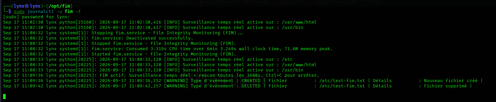
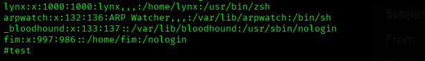
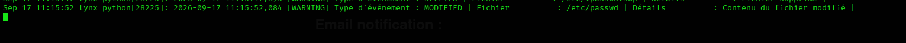
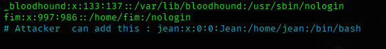
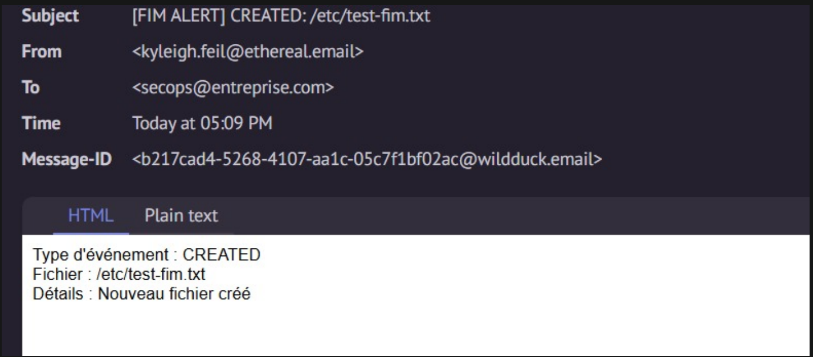
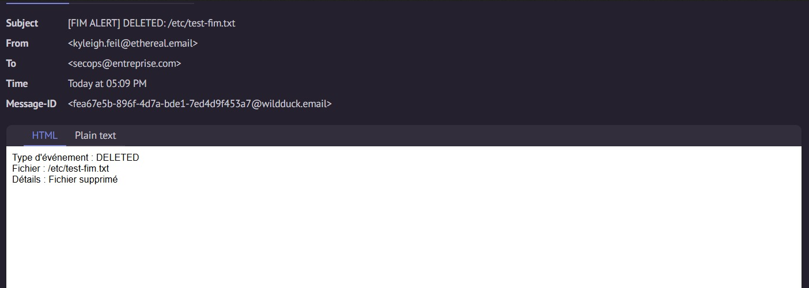
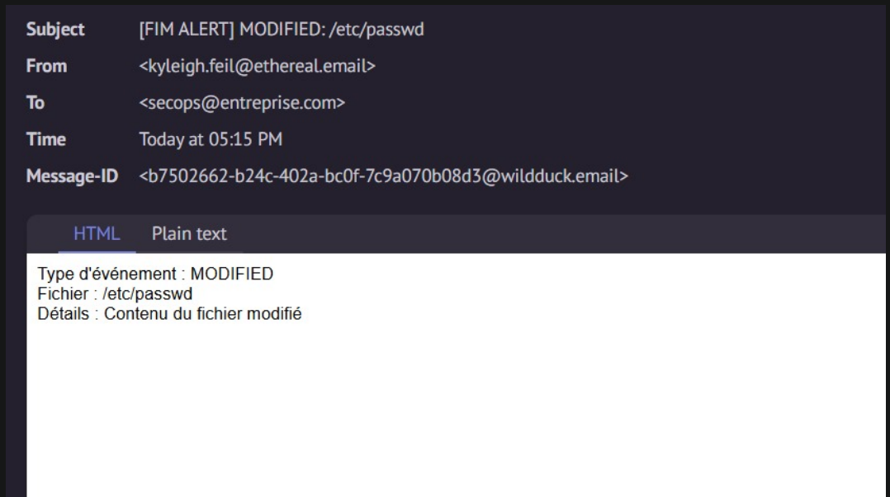

# FIM — File Integrity Monitoring

Solution de surveillance d'intégrité de fichiers pour environnement d'entreprise :
surveillance temps réel, base de données d'audit, alertes Email/Slack.

## Fonctionnalités

- **Temps réel** : détection des créations, modifications, suppressions et déplacements de fichiers via `watchdog` (inotify / FSEvents / ReadDirectoryChangesW selon l'OS).
- **Rescan périodique** : filet de sécurité qui compare l'état réel du disque à la baseline, pour rattraper tout événement manqué (redémarrage, volume réseau, etc.).
- **Hash cryptographique** (SHA-256 par défaut) pour détecter tout changement de contenu, même sans changement de taille.
- **Détection des changements de permissions/propriétaire**.
- **Base de données** : SQLite par défaut (zéro configuration) ou PostgreSQL pour une architecture centralisée multi-serveurs.
- **Alertes** : email (SMTP) et Slack (webhook), déclenchées à chaque événement.
- **Journal d'audit immuable** (`fim_event`) : historique complet, requêtable, de tous les changements détectés.

## Installation

```bash
python3 -m venv venv
source venv/bin/activate
pip install -r requirements.txt
cp config.example.yaml config.yaml
# éditer config.yaml : chemins à surveiller, base de données, alertes
```

## Utilisation

```bash
# 1. Construire la baseline initiale (état de référence "sain")
python -m fim.cli -c config.yaml init

# 2. Démarrer la surveillance temps réel
python -m fim.cli -c config.yaml monitor

# 3. Consulter l'état
python -m fim.cli -c config.yaml status

# 4. Voir le journal des derniers événements
python -m fim.cli -c config.yaml report --limit 100
```

## Déploiement en production (Linux, systemd)

```bash
sudo mkdir -p /opt/fim
sudo cp -r . /opt/fim/
sudo useradd -r -s /nologin fim
cd /opt/fim && sudo python3 -m venv venv && sudo ./venv/bin/pip install -r requirements.txt
sudo cp systemd/fim.service /etc/systemd/system/
sudo chown -R fim:fim /opt/fim
sudo systemctl restart fim
sudo systemctl daemon-reload
sudo systemctl enable --now fim
sudo journalctl -u fim -f
```

Le fichier `systemd/fim.service` durcit l'exécution (`NoNewPrivileges`, `ProtectSystem=strict`).
Adaptez le compte `fim` pour qu'il ait uniquement les droits de **lecture** sur les chemins
surveillés — jamais d'écriture, sous peine de compromettre la fiabilité du FIM lui-même.

## Points de sécurité importants pour un déploiement entreprise

1. **Protéger la base de référence (`fim.db` / PostgreSQL)** : si un attaquant peut modifier
   la baseline, il peut faire "accepter" un fichier compromis. Restreindre l'accès en écriture
   au seul compte de service, sauvegarder la base régulièrement, et envisager sa réplication
   hors du serveur surveillé.
2. **Isoler le processus FIM** : idéalement sur un hôte distinct de journalisation/agrégation,
   ou au minimum avec un compte dédié à privilèges minimaux.
3. **Alerting redondant** : envoyer les événements vers un SIEM en plus d'Email/Slack pour
   corrélation et non-répudiation (le fichier `fim.log` peut être expédié vers un collecteur
   syslog/Filebeat).
4. **PostgreSQL pour le multi-serveurs** : en configurant `database.type: postgresql` avec la
   même base pour plusieurs agents FIM, vous obtenez une vue centralisée de l'intégrité de
   toute la flotte.
5. **Ne pas oublier les faux positifs** : ajustez `exclude_patterns` pour les fichiers qui
   changent légitimement souvent (logs applicatifs, caches).
6. **Ne mets jamais** : ce mot de passe en clair dans `config.yaml` de façon permanente sans protection : au minimum, restreins les droits du fichier :

```bash
sudo chmod 600 /opt/fim/config.yaml
```
## Architecture du code

```
fim/
  config.py      # chargement de config.yaml
  database.py    # modèles SQLAlchemy (FileBaseline, FIMEvent)
  hasher.py      # calcul de hash + métadonnées fichier
  scanner.py     # construction baseline + rescan complet périodique
  watcher.py     # handler watchdog pour le temps réel
  notifier.py    # dispatch des alertes
  alerts/
    email_alert.py
    slack_alert.py
  cli.py         # commandes init / monitor / status / report
```

## Limites connues / pistes d'évolution

- Le hash est calculé de façon synchrone lors de chaque événement ; pour des volumes très
  élevés (dizaines de milliers de fichiers modifiés/seconde), envisager une file d'attente
  (Redis/RabbitMQ) entre le watcher et le worker de hashing.
- Pas de signature cryptographique de la baseline elle-même (piste : signer chaque entrée
  avec une clé HMAC pour détecter une falsification directe de la base).
- Pas d'interface web incluse ; `report`/`status` sont en CLI. Une API REST légère
  (FastAPI) au-dessus de la même base serait une extension naturelle pour un dashboard.

## Preuve de concept (POC)

Cette section documente un test de bout en bout du FIM, démontrant la détection
temps réel des changements de fichiers et l'envoi effectif des alertes email.

### Scénario de test

1. Création d'un fichier de test dans un répertoire surveillé
2. Modification du fichier critique `/etc/passwd`
3. Suppression du fichier de test

### 1. Détection en temps réel

#### Création de fichier

Un fichier créé dans un répertoire surveillé (`/etc`) est détecté immédiatement
par le watcher, sans attendre le rescan périodique.

```bash
sudo touch /etc/test-fim.txt
```

#### Suppression de fichier

```bash
sudo rm /etc/test-fim.txt
```



#### Modification de `/etc/passwd`

Toute modification du fichier `/etc/passwd` — cible sensible classique pour
la persistance d'un attaquant (ajout d'utilisateur, élévation de privilèges) —
est détectée par comparaison de hash SHA-256.






Un attaquant tente de créer un utilisateur :

```bash
sudo useradd uername
```

Cette action peut être détectée et générer une alerte de sécurité.




### 2. Notifications email reçues

Chaque événement détecté déclenche automatiquement un email d'alerte contenant
le type d'événement, le chemin du fichier, et les détails du changement.

#### Email — création de fichier



#### Email — suppression de fichier



#### Email — modification de /etc/passwd



### Résultat

| Événement                     | Détecté en temps réel | Email reçu |
|-------------------------------|:----------------------:|:----------:|
| Création de fichier           | ✅                      | ✅          |
| Modification de /etc/passwd   | ✅                      | ✅          |
| Suppression de fichier        | ✅                      | ✅          |

Le FIM détecte et notifie correctement les trois types d'événements critiques
en environnement de test, validant le fonctionnement de la chaîne complète :
surveillance → base de données → alerting.
